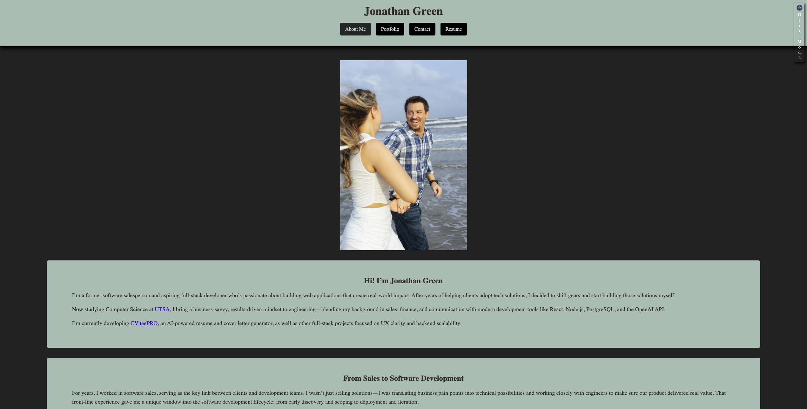

# Nathan Green Portfolio


[]()


## Table of Contents

- [About](#about)
- [Technologies Used](#technologies-used)
- [Installation](#installation)
- [Usage](#usage)
- [Contributing](#contributing)
- [Tests](#tests)
- [License](#license)
- [Questions](#questions)
- [Link to Portfolio](#Link-to-Portfolio)

---

## About

This is a comprehensive React-based single-page portfolio application designed to showcase my professional background, technical skills, and completed projects. It provides potential employers and collaborators with an in-depth look at my capabilities as an aspiring full-stack developer. Built with modern tools such as TypeScript, TailwindCSS, and Vite, the application emphasizes clean design, responsiveness, and usability.

The portfolio consists of four main sections:
- **About Me**: Highlights my career journey, interests, and goals as a developer.
- **Portfolio**: Displays detailed cards for several projects, each with live demos and GitHub repository links.
- **Contact**: Includes a functional form to submit queries or messages directly to me.
- **Resume**: Provides a downloadable version of my resume and a list of proficiencies to showcase my technical expertise.

---

## Technologies Used
* [](https://html.com/html5)
* [](https://www.w3schools.com/css/css_intro.asp)
* [](https://www.javascript.com)
* [](https://www.typescriptlang.org)
* [](https://react.dev)
* [](https://reactrouter.com/)
* [](https://vite.dev/)
* [](https://tailwindcss.com/)
* [](https://postcss.org/)
* [](https://nodejs.org)
* [](https://www.npmjs.com)


---
## Installation

This project requires several tools and dependencies to run locally. Follow the detailed steps below to set up the application on your system:

### Prerequisites
1. **Install Node.js**: Node.js is required to manage packages and run the development server. You can download it from [Node.js Official Website](https://nodejs.org/). Ensure you download the latest LTS version (18.x or higher).


2. **Install npm**: npm (Node Package Manager) is included with Node.js. You can verify its installation by running:
   ```bash
   node -v
   npm -v
   ```
3. **Install Git**: Git is necessary for cloning the repository. Download it from [Git Official Website](https://git-scm.com/).


4. **Code Editor**: It is recommended to use [WebStorm](https://www.jetbrains.com/webstorm/) or [VS Code](https://code.visualstudio.com/).

### Steps

#### 1. Clone the Repository
Begin by cloning the repository to your local machine:
```bash
git clone https://github.com/nathangreen1632/react-me.git
cd react-me
```

#### 2. Install Dependencies
Use npm to install all necessary dependencies. Run the following command in the project root directory:
```bash
npm install
```
This command will install all dependencies and development dependencies specified in the `package.json` file, such as:
- React
- React Router DOM
- TailwindCSS
- PostCSS
- TypeScript
- Vite
- Autoprefixer

#### 3. Run the Development Server
Start the development server to preview the application locally:
```bash
npm run dev
```
The default Vite development server will launch the application, and you can access it in your browser at:
[http://localhost:5173](http://localhost:5173).

#### 4. Build the Application (Optional)
To generate a production-ready build, use the following command:
```bash
npm run build
```
This will create optimized static files in the `dist` directory.

#### 5. Preview the Production Build (Optional)
To preview the production build locally:
```bash
npm run start
```

---

## Usage

The application serves as a comprehensive showcase of my professional journey and technical skills. Key features include:

- **Navigation Bar**: Located at the top of the page, it allows seamless navigation between sections: About Me, Portfolio, Contact, and Resume.
- **Portfolio Section**: Contains interactive cards for each project, including buttons for live demos and GitHub repositories.
- **Contact Form**: A functional form to submit queries or messages. The form validates input fields to ensure data accuracy.
- **Resume Section**: Features a downloadable PDF version of my resume along with a list of my technical proficiencies.




---

## Contributing

Contributions are highly encouraged. If you'd like to improve this project or add new features, please follow these steps:

1. **Fork the Repository**:
   Go to the repository's page and click on the 'Fork' button in the top-right corner.


2. **Clone Your Fork**:
   ```bash
   git clone https://github.com/YOUR_USERNAME/portfolio.git
   cd portfolio
   ```

3. **Create a New Branch**:
   ```bash
   git checkout -b feature-branch
   ```

4. **Make Changes**:
   Modify the codebase as needed.


5. **Commit Your Changes**:
   ```bash
   git add .
   git commit -m "Describe your changes"
   ```

6. **Push to Your Fork**:
   ```bash
   git push origin feature-branch
   ```

7. **Submit a Pull Request**:
   Navigate to the original repository and click 'Pull Request.' Provide a detailed description of the changes.


8. **Review Process**:
   All pull requests will be carefully reviewed for accuracy, cleanliness, and overall value to the project. If a pull request significantly enhances the project, it will be merged into the main branch. If it does not provide substantial benefits, it will not be merged. Regardless, all contributors will receive feedback on their submissions.

---

## Tests

Currently, there are no automated tests for this project. However, you can perform the following manual tests to ensure functionality:

1. Navigate through all sections using the navigation bar.
2. Validate the portfolio links by clicking on live demo and GitHub repository buttons.
3. Submit the contact form with valid and invalid inputs to verify error handling.
4. Download the resume and ensure the file opens correctly.

---

## License

This project is licensed under the MIT License. For more information, refer to the `LICENSE` file in the repository.

---

## Questions

If you have any questions or feedback, feel free to reach out via the following channels:
- **GitHub**: [nathangreen1632](https://github.com/nathangreen1632)
- **LinkedIn**: [Nathan Green](https://www.linkedin.com/in/jgreen1632)
- **Stack Overflow**: [Nathan](https://stackoverflow.com/users/27279774/nathan)

---

## Link to Portfolio

Here is a link to my Portfolio [Nathan Green Portfolio](https://react-me-portfolio.netlify.app/)
